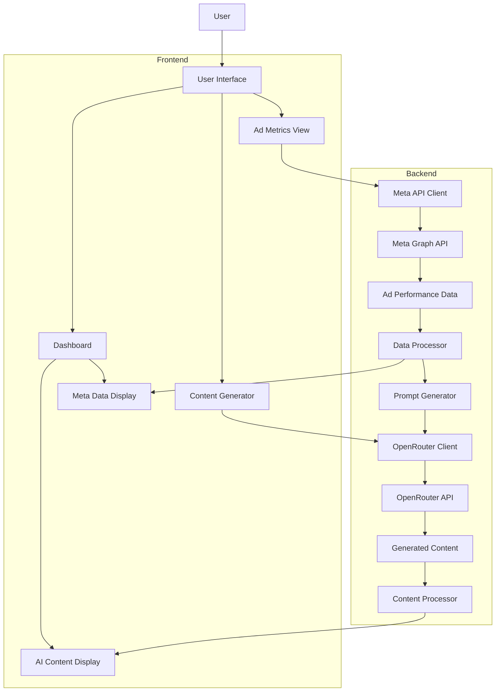

# EZ Meta Architecture

## Overview

EZ Meta is a SaaS platform that integrates Meta Ads performance monitoring with AI-powered content generation. The system leverages Next.js (App Router), TypeScript, and Tailwind CSS for the frontend, with integrations to Meta Graph API for ad performance data and OpenRouter API for AI content generation.

## System Components

### 1. User Interface (Next.js App Router)

The UI layer is built using Next.js with App Router, TypeScript, and styled with Tailwind CSS and shadcn/ui components. It consists of:

- **Dashboard**: Displays ad performance metrics and generated content suggestions
- **Ad Performance Module**: Shows detailed metrics from Meta Ads
- **Content Generator**: Interface for generating and editing AI-powered ad copy
- **Settings**: Configuration for API connections and user preferences

### 2. Meta Graph API Integration

This component handles communication with Facebook's Meta Graph API to retrieve ad performance data:

- **Authentication**: Manages Meta API authentication tokens
- **Data Fetching**: Retrieves ad performance metrics (CTR, CPC, impressions)
- **Data Processing**: Transforms raw API data into structured formats for display and analysis
- **Caching**: Implements efficient caching strategies to minimize API calls

### 3. OpenRouter API Integration

This component manages communication with OpenRouter API for AI content generation:

- **API Client**: Handles requests to OpenRouter API
- **Prompt Engineering**: Constructs effective prompts based on ad performance data
- **Response Processing**: Processes and formats AI-generated content
- **Content Storage**: Manages storage of generated content

## Data Flow

## Detailed Data Flow Process

### 1. Ad Performance Data Collection

1. User authenticates with Meta account
2. System requests access to ad account data
3. Meta Graph API client fetches performance metrics:
   - Click-Through Rate (CTR)
   - Cost Per Click (CPC)
   - Impressions
   - Reach
   - Engagement metrics
4. Data is processed and stored in local state/cache
5. UI components display the metrics in dashboard and detailed views

### 2. AI Content Generation Based on Performance Data

1. System analyzes ad performance data to identify:
   - High-performing ads
   - Underperforming ads
   - Audience engagement patterns
2. Performance insights are formatted into structured prompts
3. OpenRouter client sends prompts to OpenRouter API
4. OpenRouter API returns AI-generated content suggestions:
   - New ad copy variations
   - Creative improvement suggestions
   - Audience targeting recommendations
5. Generated content is processed and displayed to the user
6. User can edit, save, or implement the suggestions

### 3. Feedback Loop

1. User implements AI-generated content in Meta Ads
2. System continues monitoring performance of new content
3. Performance data feeds back into the AI prompt system
4. Continuous improvement cycle refines content generation

## API Integration Details

### Meta Graph API

- **Authentication**: OAuth 2.0
- **Endpoints**:
  - `/me/adaccounts`: Retrieve user's ad accounts
  - `/act_{ad_account_id}/insights`: Get performance metrics
  - `/act_{ad_account_id}/campaigns`: Get campaign data
  - `/act_{ad_account_id}/adsets`: Get ad set data
  - `/act_{ad_account_id}/ads`: Get individual ad data
- **Rate Limiting**: Implements exponential backoff for API rate limit handling

### OpenRouter API

- **Authentication**: API Key
- **Endpoints**:
  - `/api/v1/chat/completions`: Generate ad copy and creative suggestions
- **Models**: Access to various AI models through OpenRouter
- **Prompt Structure**: Structured prompts that include:
  - Ad performance context
  - Target audience information
  - Current ad copy
  - Specific improvement goals

## Data Storage

- **Client-side State**: React state management for UI
- **Server-side Caching**: Next.js server components for efficient data handling
- **Database** (future implementation): Store historical data and user preferences

## Security Considerations

- Secure storage of API keys and tokens
- Data encryption for sensitive information
- Rate limiting to prevent API abuse
- Input validation for all user inputs

## Future Enhancements

- A/B testing integration
- Advanced analytics dashboard
- Automated ad optimization
- Custom AI model fine-tuning for ad copy generation